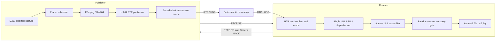

# SemiLive

SemiLive 是一个使用 C++23 实现的实时视频传输与弱网恢复项目。它从 Windows 桌面采集开始，
完成 H.264 编码、RTP/UDP 传输、RTCP 反馈、Generic NACK 重传、接收端重排与 H.264 恢复，
并通过可复现的随机丢包实验验证每项优化是否真正改善可播放视频输出。

这个项目的重点不是拼装一个完整直播产品，而是把实时音视频链路中的协议、并发、生命周期、
弱网恢复和数据观测拆成可测试、可解释的工程模块。

## 当前成果

- Windows DXGI 桌面与鼠标指针采集，固定帧率调度；
- FFmpeg/libx264 H.264 编码，支持 1080p30；
- 按 RFC 6184 实现 Single NAL 和 FU-A RTP 封包与解包；
- UDP 发送、接收和确定性随机丢包 Relay；
- 有界 RTP 重排、Access Unit 组装和 SPS/PPS/IDR 随机访问恢复；
- RTCP Sender Report、Receiver Report、Report Block、RTT 和 jitter 观测；
- RTCP Generic NACK、发送端历史缓存和原 RTP datagram 重传；
- Annex-B 文件输出和有界异步 ffplay 实时预览；
- Publisher、Relay、Receiver 三端机器可读报告和自动实验汇总；
- Windows 与 Linux CI，以及覆盖协议、状态机、并发和网络边界的 CTest 测试。

## 架构



媒体链路和控制链路使用独立 UDP endpoint。网络 I/O、协议解析、媒体处理、控制策略和进程装配
保持分层；队列、重排窗口、重传缓存和 NACK 重试都有明确上限，停止会话时按依赖关系退出并输出
最终统计。

## 弱网恢复设计

Receiver 发现 RTP 序号缺口后不会立即认定丢包，而是先给正常乱序留出短暂等待时间。缺包仍未到达
时，RTCP worker 发送 Generic NACK；Publisher 从 500ms 有界历史缓存中查找完整原始 RTP
datagram，并重新发送到原媒体 endpoint。

当前策略为：

- 首次 NACK 等待 10ms；
- 重试间隔 20ms；
- 每个缺包最多请求 2 次；
- Receiver 最多跟踪 256 个待恢复序号；
- RTP reorder buffer 最多保存 512 个包，最长等待 50ms；
- 重传保持原 RTP SSRC、序号和时间戳，不计入 RTCP SR 的原始媒体包数。

这里实现的是“原 RTP 包重传”，不是 RFC 4588 定义的独立 RTX Payload Type、SSRC 和序号空间。
这是有意控制首轮实现范围的选择，README 不把它描述成 RTX。

### 为什么 reorder buffer 是 512

最初的 64 包缓冲在大 IDR 被拆成数百个 RTP 包时会过早填满：NACK 已经发出，但重传尚未完成，
接收端就因容量压力确认缺口并丢弃当前 Access Unit。

在 3% 丢包、3 个固定 seed 的 60 秒实验中，64 包版本的 1,460 次缺口确认有 1,421 次由容量
触发，占 97.33%。将窗口扩大到 512 后，完整矩阵中同档位的容量触发缺口降至 355 次，NACK
恢复才真正转化为完整视频帧输出。按常见 1200 字节 RTP datagram 估算，这个窗口的媒体负载约为
600KiB，内存代价可控。

## 实验结果

测试条件：1920x1080、30fps、H.264、目标码率 4Mbps；每档运行 60 秒，使用 seed
`1001/1002/1003` 重复 3 次，表中为输出 Access Unit 交付率中位数。

| Relay 随机丢包率 | 无 RTCP/NACK | NACK + 64 包缓冲 | NACK + 512 包缓冲 |
|---:|---:|---:|---:|
| 0% | 100% | 100% | 100% |
| 0.1% | 46.65% | 60.78% | **100%** |
| 0.5% | 3.73% | 6.91% | **97.31%** |
| 1% | 0.47% | 3.54% | **89.49%** |
| 3% | 0.06% | 0.06% | **10.51%** |
| 5% | 0% | 0% | **3.59%** |
| 10% | 0% | 0% | **0.36%** |

最终 512 包实验共运行 21 组并全部成功：

- 0.1% 丢包下检测到的缺包全部恢复，三个 seed 的输出交付率均为 100%；
- 0.5% 丢包下 NACK 恢复率为 99.69%，最差一次输出交付率为 96.31%；
- 1% 丢包下 NACK 恢复率为 95.90%，输出交付率中位数为 89.49%；
- 3%～10% 丢包下仍能恢复 87.20%～89.80% 的缺包，但完整 H.264 帧依赖所有分片，应用层
  交付率仍会快速下降；
- 27,015 次重传缓存查询全部命中，没有缓存 miss；
- Clean 场景保持 100% 输出，没有因启用反馈和扩大缓冲而产生功能回归。

这些结果说明两个问题：NACK 能显著降低最终确认丢包，但传输层“追回大部分包”不等于应用层
“恢复大部分帧”；重排窗口必须覆盖反馈往返期间继续到达的数据，否则重传会因过早确认丢包而失去
价值。

实验使用实时桌面采集。相同 seed 可以固定 Relay 的随机判定序列，但桌面内容、编码结果和重传包
会改变后续 datagram 序列，因此对照结论来自多 seed 的方向一致性，不宣称不同运行逐包完全相同。

指标定义、实验约束和完整测试矩阵见[弱网测试矩阵](docs/testing/weak-network-matrix.md)。

## 快速构建

### Windows / MSYS2 UCRT64

```sh
pacman -Syu --needed \
  mingw-w64-ucrt-x86_64-gcc \
  mingw-w64-ucrt-x86_64-cmake \
  mingw-w64-ucrt-x86_64-ninja \
  mingw-w64-ucrt-x86_64-pkgconf \
  mingw-w64-ucrt-x86_64-spdlog \
  mingw-w64-ucrt-x86_64-ffmpeg

cmake --preset windows-debug
cmake --build --preset windows-debug
ctest --preset windows-debug
```

### Linux

Linux CI 用于验证可移植的协议、领域逻辑、Relay 和测试代码；DXGI 桌面采集只在 Windows 运行。

```sh
sudo apt-get update
sudo apt-get install --yes \
  g++ cmake ninja-build pkg-config ffmpeg \
  libspdlog-dev libavcodec-dev libavutil-dev libswscale-dev

cmake --preset linux-debug
cmake --build --preset linux-debug
ctest --preset linux-debug
```

## 本地运行

以下示例使用独立的 RTP 与 RTCP 端口。先启动 Receiver：

```sh
./build/windows-debug/bin/semilive_receiver.exe \
  --bind-address 127.0.0.1 \
  --bind-port 5004 \
  --rtcp-bind-address 127.0.0.1 \
  --rtcp-bind-port 5007 \
  --rtcp-peer-address 127.0.0.1 \
  --rtcp-peer-port 5005 \
  --output-mode ffplay \
  --stats-json receiver.json
```

再启动 Publisher：

```sh
./build/windows-debug/bin/semilive_publisher.exe \
  --rtp-address 127.0.0.1 \
  --rtp-port 5004 \
  --rtcp-bind-address 127.0.0.1 \
  --rtcp-bind-port 5005 \
  --rtcp-peer-address 127.0.0.1 \
  --rtcp-peer-port 5007 \
  --stats-json publisher.json
```

按 Ctrl+C 正常停止后，两端会写出最终 JSON 报告。Receiver 也可使用默认的文件模式输出 Annex-B
H.264，便于通过 ffmpeg、ffprobe 或其他标准工具交叉验证。

## 复现随机丢包实验

构建 Windows binaries 后，在 PowerShell 中运行：

```powershell
./tools/weak-network/run-random-loss-baseline.ps1 `
  -BuildDirectory build/windows-debug/bin `
  -DurationSeconds 60 `
  -LossPercents 0,0.1,0.5,1,3,5,10 `
  -Seeds 1001,1002,1003 `
  -EnableRtcp
```

脚本会依次启动 Publisher、Relay 和 Receiver，校验三端报告，并在独立实验目录中生成：

```text
experiments/random-loss-baseline-YYYY-MM-DD-HHMMSS/
  config.json
  runs.csv
  summary.csv
  raw/<loss-and-seed>/
```

省略 `-EnableRtcp` 得到无反馈基线；启用后运行 SR/RR、Generic NACK 和重传。实验异常中断时可用
`-OutputDirectory <原目录> -Resume` 跳过已完成样本继续执行。更多说明见
[弱网实验工具](tools/weak-network/README.md)。

## 代码与文档导航

```text
src/common       RTP/RTCP 公共协议与基础设施
src/publisher    桌面采集、编码、RTP 输出、RTCP 与重传
src/receiver     RTP 接收、重排、H.264 恢复、RTCP 与播放输出
src/relay        UDP 故障注入 Relay
tests            与生产模块对应的自动化测试
tools            可复现实验脚本
docs             设计、计划、测试方法和路线图
```

- [文档导航](docs/README.md)
- [Publisher 设计](docs/design/publisher/overview.md)
- [Receiver 设计](docs/design/receiver/overview.md)
- [Relay 设计](docs/design/relay/overview.md)
- [项目路线图](docs/roadmap.md)

## 工程取舍

- 使用 C++23、`std::expected`、RAII 和显式所有权表达错误与资源生命周期；
- 网络包进入协议层后使用拥有型内存，避免异步阶段引用接收缓冲区；
- 采集、编码、输出和 RTCP 使用独立 worker，控制面负责启动、停止、Drain 与错误汇聚；
- 对缓存、队列、重试和媒体尺寸设置上限，避免弱网或慢消费者导致无界增长；
- SR 原始媒体计数不包含重传，Relay 输入应等于原始 RTP 包数加重传包数，便于跨组件审计；
- 优先用实验暴露瓶颈并调整参数，而不是仅凭经验选择“看起来足够大”的缓冲区。

## 当前限制与下一步

当前版本仍是面向学习、验证和求职展示的工程项目，不是生产级直播系统：

- 仅完成视频链路，尚未接入系统音频和音画同步；
- 当前重传不是 RFC 4588 RTX；
- 尚未实现 PLI、FEC、带宽估计、Pacer 和拥塞控制；
- Relay 当前只注入独立随机丢包，尚未覆盖延迟、抖动、乱序、重复包和带宽限制；
- ffplay 用于阶段性预览，不保留 Receiver 的 AU 媒体时间，不能据此声称精确端到端延迟；
- 3% 以上随机丢包时，完整帧交付和随机访问恢复仍有明显改进空间；
- Linux 当前承担可移植构建与测试，还不是生产形态的多客户端媒体转发服务。

近期计划是补充重排容量与超时观测，继续验证 512/1024 包窗口，随后实现 PLI 驱动的关键帧恢复；
更长期再接入 SemiPlayer、系统音频与音画同步。

## License

项目源码采用 [MIT License](LICENSE)。FFmpeg、libx264 等外部依赖遵循各自许可证，不包含在本项目
的 MIT 授权范围内。
