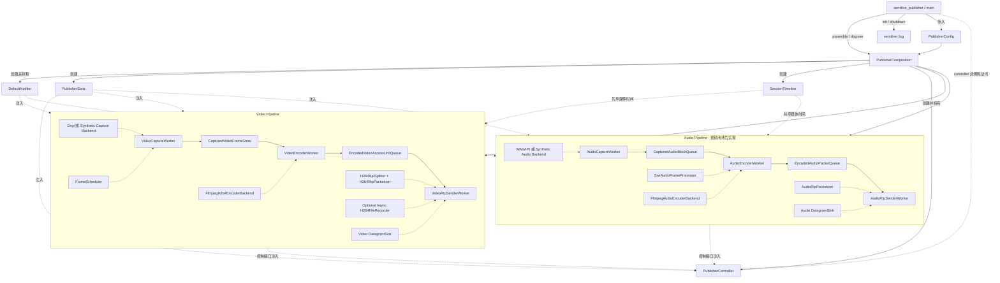

# SemiLive Publisher 音视频设计总览

本文定义 SemiLive 发布端首版音视频架构基线。设计同时覆盖桌面视频和系统音频，实施顺序
仍然是先完成可验证的视频闭环，再加入音频链路和音画同步：

```text
DXGI 桌面采集 -> BGRA 处理 -> H.264 低延迟编码 -> RFC 6184 RTP 封包 -> UDP 发送

WASAPI 系统音频采集 -> PCM 处理 -> 音频低延迟编码 -> RTP 封包 -> UDP 发送
```

本文描述两条媒体链路共同遵守的会话、时间轴、模块边界、线程模型和运行语义。尚未决定的
音频编解码和时钟映射细节明确列为实现前确认项，不为未实现功能预先创建占位代码。
实现过程中如果改变这些约定，应先更新本文并记录原因。

## 1. 范围

### 1.1 设计目标

- 使用 DXGI Desktop Duplication 采集 Windows 桌面；
- 按固定帧率产生 BGRA 视频帧；
- 缩放并转换为编码器接受的像素格式；
- 使用 FFmpeg 后端进行 H.264 低延迟编码；
- 输出 Annex-B Access Unit，支持保存为本地 `.h264` 文件；
- 将非 16:9 桌面等比缩放并填充到固定输出画布，不拉伸或裁掉桌面内容；
- DXGI 真实桌面采集支持可配置的鼠标指针合成，默认启用；
- 按 RFC 6184 完成 Single NAL 和 FU-A RTP 封包；
- 通过 UDP 向指定地址发送 RTP；
- 输出采集、丢帧、编码、队列和发送统计；
- 支持 Ctrl+C、工作线程失败和正常停止时的确定性退出。
- 定义 WASAPI Loopback 音频采集、处理、编码和 RTP 发送的模块边界；
- 建立音视频共享的会话时间轴和独立的 RTP 轨道；
- 保证音频拥塞不会阻塞视频，视频拥塞也不会阻塞音频；
- 明确双轨会话的启动、停止、排空、失败和统计语义。

### 1.2 实施顺序

首轮实现只装配并启用视频链路，依次验证本地 H.264、直接视频收发、Linux Relay 转发和
SemiPlayer 播放。音频模块在视频闭环稳定后实现，但视频阶段不得破坏本文确定的共享会话
时间轴、轨道配置和生命周期边界。

### 1.3 非目标

本阶段不实现：

- 首轮视频实现中的系统音频采集、音频编码和音画同步；
- 摄像头采集和采集源运行时切换；
- 硬件编码及 GPU 零拷贝；
- 首轮视频闭环中的 RTCP、重传、拥塞控制和自适应码率；
- RTSP、WebRTC、信令和 NAT 穿透；
- Linux Relay 和多接收端会话管理；
- GUI、预览窗口和完整 SDK 接口；
- 运行中无缝改变分辨率、帧率或编码器。

设计上明确容纳音频链路，但不预先提取 `IMediaSource`、`IMediaEncoder`、通用媒体 Graph
或继承式轨道框架。音频和视频共享会话约定，媒体处理接口保持类型明确。

## 2. 设计原则

Publisher 参考 SemiPlayer 已验证的模块风格，并针对首版音视频范围裁剪复杂度：

- 应用编排、共享模型、领域 Worker、领域资源、后端契约和基础设施分层；
- 共享模型只定义跨模块传递的数据和值类型，不依赖领域行为、契约或基础设施；
- Worker 依赖后端契约，不直接依赖 DXGI、FFmpeg 或 Winsock 具体类型；
- Worker 拥有并独占自己的线程和有线程亲和性的后端；
- 相邻 Worker 只通过容量受限的领域资源传递数据；
- 领域资源分别暴露 Sink、Source 和 Control 接口；
- 领域资源只提供非阻塞数据操作，不拥有条件变量或 Worker 停止语义；
- 通知只用于唤醒，正确性始终依赖重新检查真实谓词；
- 构造期注入依赖，运行期不使用服务定位器；
- 第一版不引入 C ABI、异步命令句柄、Generation 和通用媒体 Graph；
- 一个发布会话可以包含视频和音频轨道，两个轨道拥有独立资源、Worker、RTP 状态和 Socket；
- 两条轨道共享同一个单调会话时间轴，但使用各自的 RTP 时钟频率和随机初始时间戳；
- 首版任一已启用轨道发生致命错误时，整个发布会话失败。

## 3. 分层与模块

| 层次 | 模块 | 职责 |
|---|---|---|
| 应用层 | `PublisherController` | 校验会话状态，编排启动、停止、等待和失败汇聚 |
| 共享模型 | `MediaTime`、音视频帧和编码单元 | 定义契约、领域模块共同使用的稳定数据和值类型 |
| 领域 Worker | [`VideoCaptureWorker`](video-capture-worker.md) | 按目标帧率采集并发布 BGRA 帧 |
| 领域 Worker | [`VideoEncoderWorker`](video-encoding.md) | 消费 BGRA 帧并编排 H.264 编码与背压 |
| 领域 Worker | `VideoRtpSenderWorker` | 保存可选码流、拆分 NAL、RTP 封包和 UDP 发送 |
| 领域 Worker | `AudioCaptureWorker` | 事件驱动采集 WASAPI Loopback PCM，并保留设备时钟信息 |
| 领域 Worker | `AudioEncoderWorker` | 消费 PCM，完成格式处理、重采样和音频编码 |
| 领域 Worker | `AudioRtpSenderWorker` | 音频 RTP 封包和 UDP 发送 |
| 领域资源 | `CapturedVideoFrameStore` | 容量受限的最新视频帧存储 |
| 领域资源 | `EncodedVideoAccessUnitQueue` | 容量受限且保持编码顺序的视频 AU 队列 |
| 领域资源 | `CapturedAudioBlockQueue` | 容量受限的 PCM 块队列，过载时保持实时性并标记间断 |
| 领域资源 | `EncodedAudioPacketQueue` | 容量受限的编码音频包队列 |
| 领域服务 | `FrameScheduler` | 固定帧率调度及采集时间戳生成 |
| 领域服务 | `SessionTimeline` | 保存音视频共享的不可变单调会话原点并换算媒体时间 |
| 领域服务 | `H264NalSplitter` | 拆分 Annex-B Access Unit 中的 NAL |
| 领域服务 | `H264RtpPacketizer` | RFC 6184 Single NAL/FU-A 封包 |
| 领域服务 | `AudioRtpPacketizer` | 按选定音频格式生成 RTP Payload |
| 后端契约 | [`DesktopCaptureBackend`](desktop-capture-backend.md) | 提供最新桌面图像 |
| 后端契约 | `SystemAudioCaptureBackend` | 提供带设备位置和单调时钟关联的 PCM 块 |
| 后端契约 | `AudioFrameProcessor` | 声道布局、采样格式和采样率转换 |
| 后端契约 | [`VideoEncoderBackend`](video-encoding.md) | 接收 BGRA 帧，完成预处理并输出 H.264 AU |
| 后端契约 | `AudioEncoderBackend` | 接收处理后的 PCM 并输出编码音频包 |
| 后端契约 | `DatagramSink` | 发送一个完整数据报 |
| 基础设施 | `DxgiDesktopCaptureBackend` | D3D11/DXGI Desktop Duplication 实现 |
| 基础设施 | `SyntheticDesktopCaptureBackend` | 可重复测试画面实现 |
| 基础设施 | `FfmpegH264EncoderBackend` | 封装 libswscale 与 FFmpeg/libx264 的 H.264 编码实现 |
| 基础设施 | `WasapiLoopbackCaptureBackend` | Windows 系统音频采集实现 |
| 基础设施 | `SwrAudioFrameProcessor` | FFmpeg libswresample 音频处理实现 |
| 基础设施 | `FfmpegAudioEncoderBackend` | 首版选定格式的 FFmpeg 音频编码实现 |
| 基础设施 | `UdpDatagramSink` | Winsock UDP 实现 |
| 基础设施 | `MemoryDatagramSink` | RTP 单元和集成测试实现 |
| 基础设施 | `H264FileRecorder` | 通过独立有界队列异步保存可选 Annex-B 诊断输出 |
| 基础设施 | `DefaultNotifier` | 按事件类型同步发布轻量边界通知 |
| 公共基础设施 | `semilive::log` | 进程级异步日志、滚动文件、控制台输出和故障降级 |
| 可观测性 | `PublisherStats` | 原子计数、耗时累计、峰值和统计快照 |
| 装配层 | `PublisherComposition` | 管理进程级模块装配、所有权和逆序释放 |

## 4. 依赖关系

本节只表达对象的创建、注入和持有关系。`PublisherComposition` 在进程存活期间持有完整
对象图，但不参与运行时控制调用或媒体数据处理；运行时媒体关系由下一节的数据流图表达。

### 构造依赖图

实线表示创建，虚线表示构造函数注入或非拥有访问。`PublisherComposition::assemble()`
创建并持有完整对象图，`dispose()` 按依赖逆序释放。



`PublisherComposition` 只向 Main 暴露非拥有的 `PublisherController` 指针或引用，其有效期
从 `assemble()` 成功持续到 `dispose()` 开始。Main 不得持有 Controller 的共享所有权；
Composition 也不得暴露 Worker、Store 或 Backend 查找接口。

依赖约束：

- `VideoCaptureWorker` 和 `AudioCaptureWorker` 不知道编码器和 RTP；
- `VideoEncoderWorker` 不知道 DXGI 和 UDP；
- `AudioEncoderWorker` 不知道 WASAPI 和 UDP；
- `H264RtpPacketizer` 不知道 socket；
- `AudioRtpPacketizer` 不知道 socket；
- `DatagramSink` 不理解 H.264；
- 视频和音频 Worker 不互相调用，也不共享媒体队列或有状态后端；
- 共享模型不得依赖契约、领域模块或基础设施；
- 契约只能依赖共享模型和标准库，不得依赖领域模块或基础设施；
- 领域模块可以依赖共享模型和契约，基础设施可以依赖共享模型和契约；
- 底层模块不得依赖 `PublisherController` 或 `PublisherComposition`；
- `PublisherComposition` 只管理进程级生命周期，不作为运行期服务定位器。

日志由 Main 在 Composition 装配前初始化、在 Composition 释放后关闭，因此装配和析构阶段
也可记录故障。日志是进程级公共基础设施，不进入 Composition 对象图，也不通过构造函数
注入业务模块。

## 5. 运行时数据流

```mermaid
flowchart LR
    Desktop[Windows Desktop] --> Dxgi[DXGI Capture Backend]
    Dxgi --> VideoCapture[VideoCaptureWorker]
    VideoCapture -->|CapturedVideoFrame| FrameStore[CapturedVideoFrameStore\ncapacity = 2\ndrop oldest]
    FrameStore --> VideoEncoder[VideoEncoderWorker]
    VideoEncoder --> H264[BGRA Process + H.264 Encode]
    H264 -->|EncodedVideoAccessUnit| VideoAuQueue[EncodedVideoAccessUnitQueue\ncapacity = 4\nreject when full]
    VideoAuQueue --> VideoSender[VideoRtpSenderWorker]
    VideoSender --> VideoUdp[Video UDP Datagram Sink]

    SystemAudio[Windows System Audio] --> Wasapi[WASAPI Loopback Backend]
    Wasapi --> AudioCapture[AudioCaptureWorker]
    AudioCapture -->|CapturedAudioBlock| AudioBlockQueue[CapturedAudioBlockQueue\nbounded\ndrop old on overload]
    AudioBlockQueue --> AudioEncoder[AudioEncoderWorker]
    AudioEncoder --> AudioCodec[PCM Process + Audio Encode]
    AudioCodec -->|EncodedAudioPacket| AudioPacketQueue[EncodedAudioPacketQueue\nbounded]
    AudioPacketQueue --> AudioSender[AudioRtpSenderWorker]
    AudioSender --> AudioUdp[Audio UDP Datagram Sink]

    Clock[Shared SessionTimeline] -. media time .-> VideoCapture
    Clock -. media time .-> AudioCapture
```



第一版通过 CPU 内存传递像素。DXGI 后端在释放 acquired frame 前，将有效区域复制到独占的
紧凑 `DesktopImage`；VideoCaptureWorker 把它的像素存储移动到共享不可变
`BgraFrameBuffer`，再结合调度信息构造 `CapturedVideoFrame`。新画面和重复帧都不需要在 Worker
中额外复制整张图像。GPU 纹理跨模块传递和硬件编码留待性能数据证明必要后再设计。详细契约
见 [DesktopCaptureBackend 设计](desktop-capture-backend.md) 和
[VideoCaptureWorker 设计](video-capture-worker.md)。

## 6. 线程模型

| 执行上下文 | 所属模块 | 独占对象 | 阻塞规则 |
|---|---|---|---|
| Main | `semilive_publisher` | Controller、配置和统计展示 | 可以等待启动、停止和会话终态 |
| Video Capture Thread | `VideoCaptureWorker` | DXGI 后端、FrameScheduler、最近桌面画面 | 可以等待采集或帧率时刻；不得被下游长期阻塞 |
| Video Encode Thread | `VideoEncoderWorker` | swscale 和 FFmpeg 视频编码上下文 | 输入为空或视频 AU 输出满时等待 |
| Video Send Thread | `VideoRtpSenderWorker` | H.264 Packetizer 和视频 UDP socket | 输入为空时等待；发送失败按错误策略处理 |
| Diagnostic File Thread | `H264FileRecorder` | 诊断队列和 `.h264` 文件句柄 | 只消费有界诊断队列；不得反压视频编码或 RTP 发送 |
| Audio Capture Thread | `AudioCaptureWorker` | WASAPI 后端和设备时钟映射状态 | 可以等待 WASAPI 事件；不得被下游长期阻塞 |
| Audio Encode Thread | `AudioEncoderWorker` | swresample 和 FFmpeg 音频编码上下文 | 输入为空时等待；不得造成无界 PCM 积压 |
| Audio Send Thread | `AudioRtpSenderWorker` | 音频 Packetizer 和音频 UDP socket | 输入为空时等待；发送失败按错误策略处理 |

每个 Worker 拥有自己的线程，但线程只执行该 Worker 的私有循环。后端对象在所属线程中
打开、使用和关闭，避免跨线程调用 D3D11 context、FFmpeg codec context 和 socket 状态。
需要 COM 的 Worker 在线程入口初始化适合后端要求的 Apartment，并在线程退出前逆序关闭
后端和 COM；WASAPI 对象不得跨到其他 Worker 线程调用。

Worker 构造时启动常驻线程并进入 `Idle`，析构时请求线程永久退出并 join。一次发布会话的停止
不退出常驻线程；Controller 可以在完整停止和清理后开始下一次会话。首版会话状态机保持最小：

```text
Idle -> Starting -> Running -> Stopping -> Idle
  ^        |          |           ^
  |        |          +-> Failed -+
  +--------+
   启动失败
```

同一时刻只允许一个发布会话。Worker 对外提供同步会话接口，内部使用有限的 typed command
队列和 promise/future，把控制操作串行切换到所属线程；首版不向 Controller 暴露 future 或通用
Command Bus。详细控制协议见 [VideoCaptureWorker 设计](video-capture-worker.md)。音频与视频
各自使用独立 Socket 和线程，不要求 `DatagramSink` 支持多线程并发调用。

## 7. 共享媒体模型

共享模型只描述跨模块传递的数据，不包含 Worker 状态、队列策略、领域算法或 Backend 接口。
`MediaTime` 是相对于当前发布会话单调原点的有符号纳秒时长。它表达媒体呈现位置，不携带
墙上时间，也不等同于任何具体 RTP 时钟值。负值只允许出现在设备时钟初始校准的内部计算
中，不得进入已发布的媒体对象。

### 7.1 CapturedVideoFrame

```cpp
struct BgraFrameBuffer {
    std::vector<std::byte> bgra;
    std::uint32_t width = 0;
    std::uint32_t height = 0;
    std::uint32_t stride = 0;
};

struct CapturedVideoFrame {
    std::shared_ptr<const BgraFrameBuffer> image;
    std::uint64_t sequence = 0;
    MediaTime presentation_time;
    std::chrono::steady_clock::time_point captured_at;
};
```

约束：

- `image` 非空，并在 Worker、FrameStore 和编码线程之间共享不可变像素所有权；
- Worker 将 Backend 返回的 `DesktopImage::bgra` 移入新缓冲，不再复制像素；
- 新画面替换 Worker 的缓存引用，重复帧复用同一缓冲但具有独立的帧 metadata；
- 缓冲从创建起不保留任何可变别名，最后一个共享引用释放时自动销毁；
- `BgraFrameBuffer::stride` 首版为紧凑行宽，仍保留字段避免接口依赖隐含假设；
- `sequence` 按调度输出帧递增，重复桌面画面也产生新序号；
- `presentation_time` 由调度时刻相对会话原点换算，跨编码和发送边界保持不变；
- `captured_at` 来自单调时钟，只用于计算采集后的处理延迟，不使用系统墙上时间。

### 7.2 EncodedVideoAccessUnit

```cpp
struct EncodedVideoAccessUnit {
    std::vector<std::byte> annex_b;
    MediaTime presentation_time;
    bool key_frame = false;
    std::uint64_t source_sequence = 0;
    std::chrono::steady_clock::time_point captured_at;
};
```

约束：

- 一个对象表示同一显示时刻的完整 H.264 Access Unit；
- `annex_b` 使用 start code 分隔 NAL；
- `presentation_time` 是相对共享会话原点的媒体时间；编码器和 RTP 边界再换算为 90 kHz；
- `captured_at` 贯穿编码和发送，用于计算阶段延迟。

### 7.3 CapturedAudioBlock

```cpp
struct CapturedAudioBlock {
    std::vector<std::byte> samples;
    std::uint32_t sample_rate = 0;
    std::uint16_t channels = 0;
    AudioSampleFormat sample_format{};
    std::uint32_t sample_count = 0;
    std::uint64_t sequence = 0;
    MediaTime first_sample_time;
    std::chrono::steady_clock::time_point captured_at;
    bool discontinuity = false;
};
```

约束：

- 一个对象包含声道交错规则明确、时间连续的一段 PCM；
- `first_sample_time` 表示第一个 Sample 在共享会话时间轴上的呈现时间；
- `sample_count` 按单个声道计数，块持续时间由 `sample_count / sample_rate` 得到；
- WASAPI 报告不连续、队列主动丢弃或设备恢复后，第一个后续块设置 `discontinuity`；
- `captured_at` 只用于处理延迟统计，不能替代音频呈现时间。

### 7.4 EncodedAudioPacket

```cpp
struct EncodedAudioPacket {
    std::vector<std::byte> payload;
    std::uint32_t sample_count = 0;
    MediaTime presentation_time;
    std::uint64_t source_sequence = 0;
    std::chrono::steady_clock::time_point captured_at;
    bool discontinuity = false;
};
```

一个对象表示一次音频编码输出单元，不等同于 RTP 包。`AudioRtpPacketizer` 根据选定格式决定
一个编码输出单元生成一个还是多个 RTP 包。具体字段可随音频格式补充，但不得丢失共享媒体
时间和不连续语义。

## 8. 领域资源与背压

### 8.1 CapturedVideoFrameStore

接口拆分为：

```text
CapturedVideoFrameSink   仅供 VideoCaptureWorker
CapturedVideoFrameSource 仅供 VideoEncoderWorker
CapturedVideoFrameStoreControl 仅供 PublisherController
```

首版容量为 2。Store 已满时，接受最新帧并替换最旧的未编码帧，同时增加丢帧统计。
直播链路优先保留最新画面，不能因为编码短暂变慢而持续增加端到端延迟。

资源只提供非阻塞的 `try_push()`、`try_pop()`、`empty()` 和状态查询。Store 从空变为非空
时发送 `CapturedVideoFrameStoreNotEmpty`；Worker 的通知回调只设置 hint 并唤醒自己的条件变量。
`clear()` 只属于 Control 接口，用于停止或失败会话后的防御性清理，并返回被丢弃的帧数。

### 8.2 EncodedVideoAccessUnitQueue

接口拆分为：

```text
EncodedVideoAccessUnitSink   仅供 VideoEncoderWorker
EncodedVideoAccessUnitSource 仅供 VideoRtpSenderWorker
EncodedVideoAccessUnitQueueControl 仅供 PublisherController
```

首版容量为 4。Queue 已满时拒绝新项，`VideoEncoderWorker` 保留
`pending_access_unit` 并等待 `NotFull` 后重试。已经编码的 P 帧不能像原始采集帧一样任意
丢弃，否则会损坏后续参考关系。

如果发送端持续无法消费：

```text
AU Queue 满
-> Encoder 等待
-> CapturedVideoFrameStore 开始替换旧帧
-> 内存保持有界，延迟不持续累积
```

Queue 从空变为非空时发送 `EncodedVideoAccessUnitQueueNotEmpty`，从满变为非满时发送
`EncodedVideoAccessUnitQueueNotFull`。`clear()` 清空满队列时也发送一次 `NotFull`，并返回
被丢弃的 AU 数量。

### 8.3 CapturedAudioBlockQueue

接口同样拆分为 Sink、Source 和 Control，分别只交给 `AudioCaptureWorker`、
`AudioEncoderWorker` 和 `PublisherController`。容量以可缓存的音频时长定义，再根据实际块长
换算为元素数量；精确上限在确定 WASAPI 周期和编码帧长后决定。

音频采集不能被编码端长期阻塞。队列满时接受最新 PCM 并丢弃最旧的未编码块，同时记录被
丢弃的 Sample 数。下一块送入编码器前必须带 `discontinuity`，使编码器、统计和后续接收端
能够观察到媒体时间缺口，而不是把缺口两侧伪装成连续音频。

短暂过载以保持实时性为先；连续丢弃超过配置阈值时由 `AudioCaptureWorker` 上报致命错误，
防止会话在严重异常下长期输出破碎音频。

### 8.4 EncodedAudioPacketQueue

该队列保持编码输出顺序且容量固定。音频不采用视频参考帧的 pending AU 规则，也不能因为
发送变慢而无限阻塞编码并积压 PCM。队列满时的精确丢弃策略取决于首版音频格式：设计必须
在选定编码格式后明确可丢弃边界、RTP 时间戳缺口和 Decoder 恢复语义。

无论选择哪种策略，队列过载都不能修改后续 `presentation_time` 来隐藏缺口；持续过载最终
使会话失败。

四个资源都不包含条件变量、`stop_token`、阻塞等待、`close()` 或 `closed` 状态。每个
Worker 使用自己的条件变量统一响应资源 hint、控制命令、失败和线程退出，并在醒来后重新
检查资源的真实状态。正常停流由 Controller 按序命令 Worker 排空，资源析构只发生在所有
Worker 线程停止之后。

## 9. 共享时间轴、时间戳与帧率

视频 deadline、首帧、晚到跳帧和画面复用的权威规则见
[FrameScheduler 设计](frame-scheduler.md)。本节只保留音视频共享时间语义和 RTP 映射摘要。

Controller 在任何媒体 Worker 启动前创建不可变的会话时间原点：

```text
session_origin = steady_clock::now()
```

`SessionTimeline` 在会话运行期间不得改变原点。停止完成且所有 Worker 回到 Idle 后，下一次
`start_publishing()` 才能建立新的原点；上一次会话的媒体对象必须已经排空或清理。

共享媒体对象使用相对于该原点的 `MediaTime`。`MediaTime` 表示媒体呈现位置，不绑定具体编码器
或 RTP 时钟频率：

```text
media_time = presentation_clock_time - session_origin
video_clock_ticks = round(media_time * 90000)
audio_clock_ticks = round(media_time * audio_clock_rate)
```

实现使用 `MediaTime = std::chrono::nanoseconds`。`media_time_to_clock_ticks()` 只接受正的时钟
频率和非负的已发布媒体时间，使用整数运算按最近 tick 舍入，并在宽位结果溢出时失败；不得
使用浮点换算。`media_time_to_rtp_timestamp()` 将宽位 tick 偏移与随机初始时间戳相加，最终
按无符号 32 位自然回绕。

视频摘要：

- 默认使用 30/1 fps 和基于绝对 deadline 的调度，不相对休眠或突发补帧；
- PTS 来自计划调度点；DXGI 没有新画面时重复最近有效画面并获得新的序号和 PTS；
- 编码器 time base 使用 `1/90000`；
- RTP 初始时间戳随机生成；
- `rtp_timestamp = video_initial_timestamp + video_clock_ticks`，按无符号 32 位自然回绕；
- 一个 Access Unit 的所有 RTP 包共享同一时间戳；
- 不使用系统墙上时间，不假设 RTP 时间戳永不回绕。

尚未取得第一帧时不生成空白帧，具体调度点消耗和统计口径由 FrameScheduler 设计定义。

音频规则：

- 音频呈现时间优先根据 WASAPI 设备位置及其 QPC/单调时钟关联计算，而不是使用回调到达时间；
- 一个 `CapturedAudioBlock` 的时间戳指向第一个 Sample；
- 首次读取中早于 `session_origin` 的 Sample 被精确裁掉，不把负时间戳钳制为零；
- 后续 Sample 时间由采样率和 Sample 位置推导，不能按每次读取的墙上时间重新起算；
- 音频 RTP 初始时间戳独立随机生成，RTP 时钟频率由选定的音频格式规定；
- WASAPI 不连续、主动丢弃和设备恢复都保留媒体时间缺口并设置 `discontinuity`；
- 音频设备时钟与会话单调时钟可能长期漂移，首版音频实现前必须确定检测阈值和重采样校正边界。

`captured_at` 继续保留为采集完成的单调时刻，只用于阶段延迟统计。它不是通用 PTS，不能
用它覆盖设备提供的音频呈现位置。

因为两条 RTP 轨道的初始时间戳独立随机，Receiver 不能仅凭 RTP Header 恢复二者的时间
关系。首版必须在实现音频前，从 RTCP Sender Report 或会话描述携带轨道时间映射两种方案
中选定一种。视频实现可以暂不发送该映射，但配置和传输设计不得假设永久只有一个时钟域。

## 10. 编码、轨道和 RTP 基线

### 10.1 视频参数

| 参数 | 默认值 |
|---|---:|
| 输出分辨率 | 1920 x 1080 |
| 帧率 | 30 fps |
| 编码器 | FFmpeg `libx264` |
| 编码输入像素格式 | YUV420P |
| 视频码率 | 4 Mbps |
| GOP | 60 帧 |
| B 帧 | 0 |
| 编码预设 | `ultrafast` |
| 低延迟调优 | `zerolatency` |
| H.264 输出 | Annex-B |
| RTP Payload Type | 96 |
| RTP Clock Rate | 90000 |
| UDP MTU | 1200 bytes |

RTP 规则：

- 小于有效 MTU 的 NAL 使用 Single NAL Unit；
- 大 NAL 使用 FU-A，禁止产生空分片；
- Marker 只设置在 Access Unit 最后一个 RTP 包；
- 序列号和 SSRC 在会话开始时随机生成；
- SPS/PPS 在 IDR 前以带内方式提供；
- 首轮视频闭环不实现 STAP-A、RTCP 和丢包恢复。

`VideoEncoderBackend` 保持可替换，但首版真实编码实现只请求 FFmpeg `libx264`，并在同一 Backend
内部封装 libswscale 预处理和编码资源，不公开通用 YUV 中间对象或 FFmpeg 类型。普通无设备 CI
使用 Fake Encoder；启用 FFmpeg 集成验证的环境找不到 `libx264` 时必须给出明确配置错误。关闭
B 帧以避免帧重排，简化首版实时链路的 PTS/DTS 关系并降低延迟。硬件编码留作视频闭环稳定后
的独立增强项。

输入桌面不是 16:9 时，Backend 等比缩放到 1920 x 1080 画布并居中填充，禁止拉伸或裁掉桌面
边缘。首版固定 BT.709 limited-range YUV420P，黑边使用对应的 YUV 黑色值；缩放区域和填充
边界必须可单元测试。预处理与编码首版由同一个 Video Encode Thread 顺序编排，libx264 可以在
Backend 内部并行；只有性能数据证明持续吞吐不足时才设计独立预处理线程。详细规则见
[视频编码阶段设计](video-encoding.md)。DXGI 后端提供鼠标指针合成配置，真实桌面发布默认开启；
Synthetic 和早期无设备编码闭环不依赖指针。

### 10.2 视频诊断文件

M1 只启用 `.h264` 文件输出，用 ffprobe 和 ffplay 验证编码结果；M2 以 RTP 为主输出，允许
同时启用可选 `.h264` 诊断记录。双输出不引入通用媒体 Graph，也不增加第二个领域 AU
消费者：`VideoRtpSenderWorker` 在处理 AU 时向 `H264FileRecorder` 提交一份 Annex-B 数据
副本，Recorder 通过独立线程和有界队列写盘。提交操作始终非阻塞；默认队列同时受 64 个
AU 和 8 MiB 字节预算约束，达到任一上限即视为记录过载。

文件记录属于 best-effort 诊断能力，不参与发布会话正确性：诊断队列已满、文件打开失败或
写入失败时，Recorder 停止本次记录、保留并明确标记不完整文件、更新统计并报告非致命
诊断错误；视频编码和 RTP 发送继续运行。性能和 30 分钟稳定性验收默认关闭文件记录，避免
把磁盘吞吐计入实时链路结果。

### 10.3 音频参数

首版音频格式必须同时满足 FFmpeg 开发/CI 环境可用、SemiPlayer 可解码、存在明确 RTP
Payload 格式和适合低延迟四个条件。编码格式、采样率、声道数、编码帧长、码率、Payload
Type 和 RTP 时钟频率列为音频实现前确认项，不在未验证环境前写死。

### 10.4 双轨传输

一个发布会话包含零或一条视频轨道以及零或一条音频轨道，至少启用一条。首版不支持同类
多轨。每条轨道拥有独立的：

- SSRC、Payload Type、RTP 序列号和随机初始时间戳；
- 目标 UDP 端口和 `DatagramSink` 实例；
- Packetizer、发送 Worker、队列和传输统计。

视频和音频首版使用不同 UDP 端口，不在同一个 Socket 上复用。这保持 Worker 对 Socket
的线程独占，并避免共享发送队列造成跨媒体背压。会话描述必须关联两条轨道，并提供 codec、
endpoint、Payload Type、SSRC、clock rate 及共享时间映射所需信息。

## 11. 启动、停止和错误传播

### 11.1 进程装配

Main 调用 `PublisherComposition::assemble()` 创建 Notifier、资源、后端、Worker 和
Controller。Worker 线程属于模块生命周期，可以在装配阶段启动并等待控制命令；装配失败
时 Composition 逆序停止并释放已经创建的模块。

Composition 根据配置装配已启用轨道。首轮视频实现只创建视频对象，不创建空的音频 Worker
或 Backend；音频实现完成后，同一个 Composition 可以同时装配两条完整链路。

装配成功后，Main 通过 Composition 获取有效期受限的 Controller 非拥有访问。Main 只调用：

```text
PublisherComposition: assemble / controller / dispose
PublisherController: start_publishing / stop_publishing / state / stats
```

### 11.2 开始发布

`PublisherController::start_publishing()` 先清理上一次非正常会话残留，建立共享
`SessionTimeline`，再按消费者到生产者的阶段顺序配置并启动所有已启用轨道：

```text
0. 可选 H264FileRecorder
1. VideoRtpSenderWorker / AudioRtpSenderWorker
2. VideoEncoderWorker / AudioEncoderWorker
3. VideoCaptureWorker / AudioCaptureWorker
```

诊断 Recorder 打开文件失败时只禁用本次记录并报告非致命错误，不阻止 Sender 启动。

同一阶段内按确定顺序同步启动 Worker。首版接受有界的初始化顺序差异，不要求两个采集后端在
同一时刻产生首个媒体单元；Capture Worker 在各自后端成功打开后记录真实 `track_start`，并
依靠共享时间轴表达实际开始位置。Video Capture 的接口和确认语义见
[VideoCaptureWorker 设计](video-capture-worker.md)。若后续测量证明多轨道必须严格并行启动，
再让现有内部 completion future 穿过 Worker 接口。

任一阶段启动失败时，Controller 按逆序 abort 所有已经启动的轨道模块、清理资源并返回结构化
错误；此时不要求排空尚未形成完整运行链路的数据。Worker 模块及其常驻线程仍由 Composition
持有。

### 11.3 正常停止

Ctrl+C 触发正常停止：

```text
1. Controller 按确定顺序同步停止 VideoCaptureWorker 和 AudioCaptureWorker
2. 确认所有已启用的 Capture Worker 不再产生新媒体
3. 以 Drain 模式命令两个 Encoder Worker 分别排空输入并 flush 编码器
4. 等待两个 Encoder Worker 回到 Idle
5. 命令两个 RTP Sender Worker 分别排空编码输出并关闭 socket
6. 等待两个 Sender Worker 回到 Idle
7. 命令可选 H264FileRecorder 排空已接受的诊断数据并关闭文件
8. Controller 通过 Control 接口防御性 clear 所有空资源并回到 Idle
```

Capture Backend 查询非阻塞且调度等待可由 StopCommand 唤醒，因此同步停止是有界操作。因为
所有领域资源都有固定容量，正常停止时的剩余工作量也有明确上界。Encoder 的 Drain/Abort
语义见 [视频编码阶段设计](video-encoding.md)。

### 11.4 致命错误

Worker 只上报第一个致命错误。首版任一已启用轨道失败均视为发布会话失败。Controller 收到
错误 hint 后在控制执行上下文中按错误停机顺序同步停止所有已启用 Worker；Encoder 使用 Abort
而不是等待下游腾空，Worker 自己的条件变量由 StopCommand 直接唤醒，不依赖资源通知。致命
错误路径不保证排空媒体数据，Controller 通过 Control 接口清理残留数据，优先保证及时、确定地
回到 Failed 状态。

错误包含：

- 领域错误类别；
- 失败操作；
- DXGI、WASAPI、FFmpeg 或 Winsock 原生错误码；
- 可读错误信息。

异常不得越过线程入口；Worker 顶层捕获异常并转换为内部失败。

### 11.5 进程释放

Main 在退出前调用 `PublisherComposition::dispose()`。如果当前会话仍在运行，Composition
先要求 Controller 停止会话，再停止 Controller 控制线程和所有已装配 Worker 常驻线程，最后按
依赖逆序释放 Worker、Backend、资源、Stats 和 Notifier。

资源析构时必须已经没有线程访问它们。`dispose()` 幂等；Composition 析构函数将其作为
兜底调用，但正常路径仍显式调用，以便记录停止失败。

## 12. 可观测性

`PublisherStats` 不创建线程。所有 Worker 更新原子计数和耗时累计，Main 每秒读取一致的
统计快照。快照按 `session`、`video` 和 `audio` 分组；未启用轨道明确标记为 disabled，
不以全零数据冒充已运行轨道。

首版至少记录：

- DXGI 新画面数量；
- 调度输出帧数；
- 采集帧替换数量；
- 编码输入和输出帧数；
- 关键帧数量；
- 编码失败数量；
- 预处理、codec 和完整编码阶段的平均、最大耗时；
- H.264 输出字节数和估算码率；
- RTP 包数、发送字节数和 UDP 错误数；
- 诊断文件接受、写入和拒绝的 AU 与字节数，以及打开、写入和过载失败次数；
- 两个视频领域资源的当前水位和峰值水位；
- 采集到编码完成、采集到发送完成的平均和最大延迟。

音频实现后至少增加：

- WASAPI 捕获块数、Sample 数、静音块和设备不连续次数；
- 主动丢弃的 PCM 块数、Sample 数及连续丢弃时长；
- 音频编码输入、输出、失败、平均和最大耗时；
- 编码音频字节数、估算码率、RTP 包数和 UDP 错误数；
- 两个音频资源的当前水位、峰值水位和缓存时长；
- 音频采集到编码完成、采集到发送完成的平均和最大延迟；
- 音频设备时间相对共享会话时间的偏差和漂移估计。

日志不承载高频指标；逐帧、逐包日志默认关闭。

日志采用异步 `OverrunOldest` 策略，避免日志队列反压采集、编码和发送线程。Worker 只记录
生命周期、状态迁移、后端错误和周期汇总；Notifier 捕获的回调异常必须记录后继续分发。

## 13. 测试策略

### 13.1 领域单元测试

- `CapturedVideoFrameStore` 容量、替换、clear 和 `NotEmpty` 边界通知；
- `EncodedVideoAccessUnitQueue` 顺序、满、pending AU、clear 和边界通知；
- 两个音频队列的容量、不连续传播、过载阈值和 clear 边界通知；
- Notifier 的类型隔离、订阅生命周期和并发分发；
- FrameScheduler 帧率和 PTS 单调性；
- SessionTimeline 的共同原点、整数舍入、视频 90 kHz、音频时钟频率和 RTP 回绕换算；
- 音频 Sample 位置、块持续时间和时间戳连续性；
- Annex-B NAL 拆分；
- RTP Header、序列号、时间戳和 Marker；
- FU-A 边界、重组一致性和 MTU 上界；
- Worker 停止、后端失败和 pending output；
- VideoCaptureWorker 的启动确认、可停止 deadline 等待、画面复用、恢复超时和重复会话。

### 13.2 无设备集成测试

```text
SyntheticDesktopCaptureBackend
-> VideoCaptureWorker
-> CapturedVideoFrameStore
-> VideoEncoderWorker
-> FakeVideoEncoderBackend 或 FFmpeg Backend
-> VideoRtpSenderWorker
-> MemoryDatagramSink
```

普通 Windows/Linux CI 不依赖真实桌面、显卡或网络。

音频实现后增加无设备链路：

```text
SyntheticSystemAudioCaptureBackend
-> AudioEncoderWorker
-> FakeAudioEncoderBackend 或 FFmpeg Backend
-> AudioRtpSenderWorker
-> MemoryDatagramSink
```

联合测试必须覆盖音视频首个媒体单元到达时间不同、任一轨道启动失败、任一轨道运行期失败、
同时停止和共享时间映射。

### 13.3 外部交叉验证

- Synthetic/DXGI -> FFmpeg 编码 -> `.h264`；
- 使用 `ffprobe` 检查编码格式、分辨率、帧率和时间戳；
- 使用 `ffplay` 播放输出；
- 使用 SemiStreamProbe 检查 RTP/NAL/FU-A；
- 视频闭环完成后执行 1080p30、30 分钟稳定性测试。
- 音频实现后使用标准工具验证编码输出、采样率、声道和连续时间戳；
- 音视频闭环完成后执行 30 分钟同步与漂移测试。

DXGI 真实桌面测试属于 Windows 专用集成测试，不作为无桌面 CI 的硬性条件。

## 14. 建议目录

```text
src/common/
  infrastructure/
    log/...

src/publisher/
  application/
    publisher_controller.*
    publisher_config.*

  model/
    media_time.hpp
    video/bgra_frame_buffer.hpp
    video/captured_video_frame.hpp
    video/encoded_video_access_unit.hpp
    video/frame_rate.hpp
    video/video_dimensions.hpp
    audio/captured_audio_block.hpp
    audio/encoded_audio_packet.hpp

  contracts/
    capture/desktop_capture_backend.*
    capture/system_audio_capture_backend.*
    processing/audio_frame_processor.*
    encoder/video_encoder_backend.*
    encoder/audio_encoder_backend.*
    transport/datagram_sink.*

  domain/
    resource/captured_video_frame_store/...
    resource/encoded_video_access_unit_queue/...
    resource/captured_audio_block_queue/...
    resource/encoded_audio_packet_queue/...
    worker/video_capture/...
    worker/video_encoder/...
    worker/video_rtp_sender/...
    worker/audio_capture/...
    worker/audio_encoder/...
    worker/audio_rtp_sender/...
    video/video_placement.*
    rtp/h264_nal_splitter.*
    rtp/h264_rtp_packetizer.*
    rtp/audio_rtp_packetizer.*
    timing/frame_scheduler.*
    timing/media_time_conversion.*
    timing/session_timeline.*
    stats/publisher_stats.*

  infrastructure/
    notifier/notifier.*
    notifier/default_notifier.*
    capture/dxgi_desktop_capture_backend.*
    capture/synthetic_desktop_capture_backend.*
    capture/wasapi_loopback_capture_backend.*
    capture/synthetic_system_audio_capture_backend.*
    ffmpeg/ffmpeg_h264_encoder_backend.*
    ffmpeg/swr_audio_frame_processor.*
    ffmpeg/ffmpeg_audio_encoder_backend.*
    transport/udp_datagram_sink.*
    transport/memory_datagram_sink.*
    output/h264_file_recorder.*

  composition/
    publisher_composition.*

  main.cpp
```

测试目录按相同层次镜像组织。实现时允许在不破坏依赖方向的前提下合并过小文件，避免为
目录结构本身制造样板代码。

CMake 的部署目标对应三个最终程序。Publisher 额外提供一个不包含 `main.cpp` 的
`semilive_publisher_core` 静态库，共享模型、契约、领域、应用、基础设施和装配子目录通过 `target_sources`
向 Core 添加实现；Publisher 程序和相关测试统一链接 Core。内部模块不再继续拆分静态库，
避免把源码目录边界等同于链接边界。

## 15. 已决定与延后决定

### 已决定

- 设计覆盖音视频，实施先完成视频闭环，再实现音频和音画同步；
- 不为尚未实现的音频创建占位代码或通用媒体 Graph；
- 视频和音频各由 Capture、Encoder、RTP Sender 三个 Worker 组成，每个 Worker 独占线程；
- 两条轨道共享单调会话时间轴，共享模型中的媒体时间不绑定 RTP 时钟频率；
- 两条轨道拥有独立 SSRC、Payload Type、RTP 状态、UDP 端口、Socket、队列和统计；
- 首版不支持同类多轨，至少启用一条轨道；
- 任一已启用轨道发生致命错误时，整个发布会话失败；
- BGRA CPU 帧跨采集和编码线程传递；
- 后端契约只暴露接收 BGRA 并输出 H.264 AU 的 VideoEncoderBackend，不暴露通用 YUV 中间对象；
- 像素处理与编码由同一个 Worker 线程执行，FFmpeg Backend 内部按转换和 codec 职责拆分；
- 正常停止排空并 flush Encoder，故障停止使用 Abort 丢弃剩余内部工作；
- 采集帧资源容量 2，满时替换最旧帧；
- 编码 AU 资源容量 4，满时保留 pending AU 并等待；
- 资源只提供非阻塞操作和边界通知，Worker 自己负责条件等待；
- Sink/Source 不提供关闭和清空能力，clear 只通过 Control 接口暴露给 Controller；
- Composition 持有进程级对象图，Controller 只编排存活期间的发布会话；
- H.264、Annex-B、90 kHz 时间基、RTP/UDP、Single NAL 和 FU-A；
- 首版真实视频编码使用 FFmpeg `libx264`、YUV420P、1080p30、4 Mbps、GOP 60、无 B 帧；
- 非 16:9 桌面等比缩放并居中黑边填充，不拉伸或裁剪；
- DXGI 鼠标指针合成可配置，真实桌面发布默认开启；
- M1 使用 `.h264` 文件验证，M2 允许 RTP 与异步 best-effort 诊断记录同时开启；
- 诊断文件队列或写入失败只终止记录，不得反压或终止视频发布；
- 音频采集不得被下游长期阻塞，所有音频积压有界且必须保留不连续语义；
- 使用 Synthetic、Fake 和 Memory 后端保证两条链路可测试性。

### 实现前确认

- 首版音频编码格式及 FFmpeg、SemiPlayer、RTP Payload 兼容性；
- 音频采样率、声道数、编码帧长、码率、Payload Type 和 RTP 时钟频率；
- WASAPI 设备位置到共享会话时间的精确映射；
- 音频设备漂移的检测阈值和重采样校正边界；
- 编码音频队列满时的格式相关丢弃与恢复策略；
- 音视频 RTP 时间关系通过 RTCP Sender Report 还是会话描述传递；
- 双轨会话描述的具体格式和交换方式。

### 后续阶段再决定

- 硬件编码和 GPU 零拷贝；
- 运行时采集设备及编码参数切换；
- 除音画时钟映射可能需要的 Sender Report 外，其他 RTCP、反馈、重传和拥塞控制；
- Relay 会话协议和多接收端管理。
