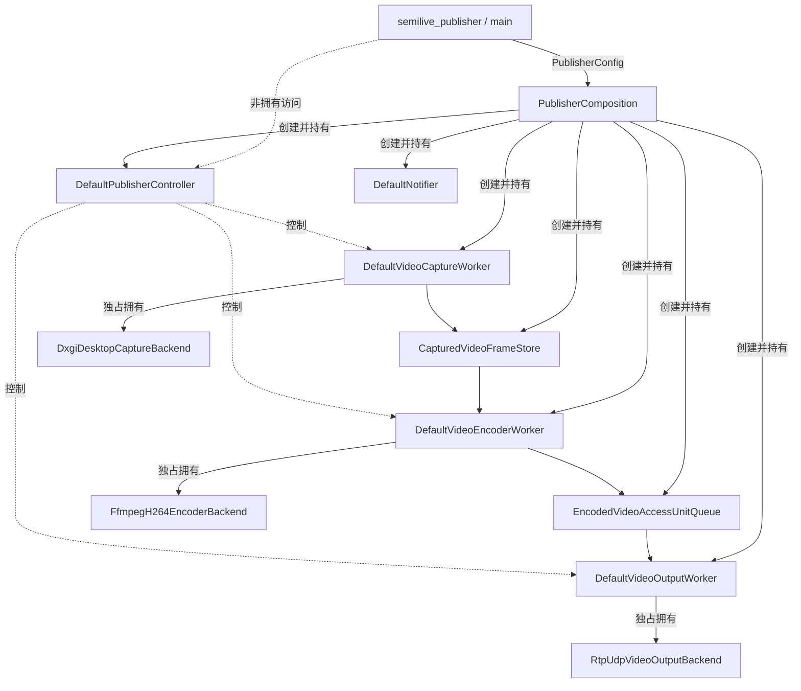

# PublisherComposition 设计

本文定义 Publisher 首版组合根的架构位置、目录、职责、所有权和对外接口。
`PublisherComposition` 是进程级对象图所有者：它创建、注入、持有并逆序释放 Publisher
模块，但不参与运行期媒体处理，也不替代 `PublisherController` 的会话编排职责。

当前对象图实现 M2 视频链路：Windows DXGI 桌面采集、FFmpeg/libx264 编码和
`RtpUdpVideoOutputBackend` 主输出。不为尚未实现的音频创建占位对象或通用媒体 Graph。
M1 的 `H264FileOutputBackend` 仅保留为历史验收和隔离测试能力；可选调试文件旁路属于后续增量。
RTP 输出细节见 [RTP/UDP 视频输出 Backend 设计](rtp-udp-video-output.md)。

## 1. 架构位置



进程入口、Composition 和 Controller 的边界固定为：

- Main 解析命令行，初始化和关闭日志，安装 Ctrl+C handler，调用 Controller，
  输出最终统计和退出码；
- Composition 把进程配置转换为一个固定对象图，管理其进程级生命周期；
- Controller 在已存在的对象图上编排可重复的发布会话；
- Worker 执行媒体阶段，Backend 实现 DXGI、FFmpeg、RTP 和 UDP 等外部能力。

Composition 不实现通用依赖注入容器、Backend 注册表或运行期服务定位器。首版
只显式构造一条类型明确的视频链路。

## 2. 目录与 Target

```text
src/publisher/
  composition/
    CMakeLists.txt
    include/semilive/publisher/composition/
      publisher_config.hpp
      publisher_composition.hpp
    src/
      publisher_composition.cpp

tests/publisher/
  composition/
    CMakeLists.txt
    publisher_composition_test.cpp
```

`publisher_config.hpp` 只公开进程级配置值。`publisher_composition.hpp` 只公开生命周期、
Controller 访问和结构化错误。具体 Worker、Backend、资源、状态和析构顺序都隐藏在
PImpl 中，避免将基础设施头文件暴露给 Main。

新增静态库目标：

```text
SemiLive::PublisherComposition
```

依赖方向：

```text
PublisherCore
  -> PublisherComposition

PublisherComposition
  PUBLIC  -> PublisherApplication
  PRIVATE -> PublisherDomain
          -> PublisherInfraCapture
          -> PublisherInfraFfmpeg
          -> PublisherInfraNotifier
          -> PublisherInfraOutput
```

Composition 不依赖 `SemiLive::CommonLog`。装配和释放错误通过结果返回给 Main，由 Main
在正确的日志生命周期内记录。测试只链接 `PublisherComposition` 及其公开依赖，不通过
`PublisherCore` 扩大可见边界。

## 3. 进程配置

当前使用类型明确的视频和 RTP/UDP 输出配置：

```cpp
namespace semilive::publisher::composition {

struct PublisherVideoConfig {
    contracts::capture::DesktopCaptureConfig capture{};
    std::chrono::milliseconds recovery_timeout{5000};
    contracts::encoder::VideoEncoderConfig encoder{};
};

struct RtpUdpVideoOutputConfig {
    std::string destination_address;
    std::uint16_t destination_port = 0;
    std::uint8_t payload_type = 96;
    std::size_t max_datagram_bytes = 1200;
};

struct PublisherVideoOutputConfig {
    RtpUdpVideoOutputConfig rtp_udp;
};

struct PublisherConfig {
    PublisherVideoConfig video;
    PublisherVideoOutputConfig output;
};

}  // namespace semilive::publisher::composition
```

Composition 直接复用已有的 `DesktopCaptureConfig` 和 `VideoEncoderConfig`，不重复定义媒体
值类型。采集和编码只使用 `encoder.frame_rate` 这一个帧率来源。

FrameStore 容量 2 和 AU Queue 容量 4 是当前领域实时策略，不作为进程公开配置。
稳定性或性能数据证明需要调整时，再将它们引入内部调优配置。

具体输出配置由 Composition 转换为 infrastructure Backend 配置，不下沉到通用 Output Worker
接口。后续增加调试文件时，它仍是 RTP Backend 的可选旁路，不增加文件/RTP 互斥 `variant`。

### 3.1 配置校验边界

Composition 在创建对象前校验进程级和跨模块不变式，包括：

- RTP 目的地址不得为空，目的端口不得为零；
- RTP Payload Type 必须在动态范围 `96..127`；
- 最大数据报大小必须在 `15..65507`；
- recovery timeout 必须为正值；
- 必须启用唯一的视频轨道和唯一的 RTP/UDP 主输出；
- 当前平台必须存在可用的生产采集 Backend。

编码器可接受值、DXGI 输出选择、数值 IP 地址和 Socket 可打开性继续由对应 Backend 在会话启动时校验，
并通过 Controller 保留原始结构化 Issue。Composition 不复制 Backend 的业务校验逻辑，也不创建
输出目录。

## 4. 职责边界

### 4.1 Composition 负责

- 保存构造时传入的进程配置；
- 校验组合层配置和平台支持；
- 创建 Notifier、领域资源、Backend、Worker 和 Controller；
- 把 Backend 独占所有权移交给对应 Worker；
- 向 Worker 注入资源窄接口和共享 Notifier；
- 向 Controller 注入三个 Worker、两个资源 Control 接口和 Notifier；
- 装配失败时逆序回滚已创建的部分对象；
- 向 Main 提供 Controller 的非拥有访问；
- 进程释放时先尝试结束会话，再按依赖逆序销毁对象；
- 保证 `dispose()` 幂等，并在析构函数中执行无异常的兜底释放。

### 4.2 Composition 不负责

- 解析命令行或环境变量；
- 初始化、配置或关闭日志；
- 安装 Ctrl+C handler 或执行进程等待循环；
- 主动调用 `start_publishing()` 启动正常业务；
- 作为 Worker、Store、Queue 或 Backend 查询器；
- 传递、处理或记录每帧媒体数据；
- 在运行中更换 Backend、输出路径或媒体配置；
- 创建每次会话的 `SessionTimeline`；
- 实现启动、Drain、Abort、故障汇聚或统计快照逻辑。

`SessionTimeline` 继续由 Controller 在每次 `start_publishing()` 时创建。`FrameScheduler`
继续是 Capture Worker 的会话内部状态，不是 Composition 成员或构造注入项。

## 5. 对外接口

```cpp
#pragma once

#include <semilive/publisher/application/publisher_controller/publisher_controller.hpp>
#include <semilive/publisher/composition/publisher_config.hpp>

#include <expected>
#include <memory>
#include <optional>
#include <string>

namespace semilive::publisher::composition {

enum class PublisherCompositionOperation {
    Control,
    ValidateConfig,
    CheckPlatform,
    CreateNotifier,
    CreateResources,
    CreateOutputWorker,
    CreateEncoderWorker,
    CreateCaptureWorker,
    CreateController,
    StopSession,
    DisposeGraph,
};

struct PublisherCompositionIssue {
    PublisherCompositionOperation operation =
        PublisherCompositionOperation::Control;
    std::optional<application::PublisherControllerIssue> controller_issue;
    std::string message;
};

using PublisherCompositionResult =
    std::expected<void, PublisherCompositionIssue>;

class PublisherComposition final {
public:
    explicit PublisherComposition(PublisherConfig config);
    ~PublisherComposition();

    PublisherComposition(const PublisherComposition&) = delete;
    PublisherComposition& operator=(const PublisherComposition&) = delete;
    PublisherComposition(PublisherComposition&&) = delete;
    PublisherComposition& operator=(PublisherComposition&&) = delete;

    [[nodiscard]] PublisherCompositionResult assemble();

    [[nodiscard]] application::PublisherController* controller() noexcept;
    [[nodiscard]] const application::PublisherController*
    controller() const noexcept;

    [[nodiscard]] PublisherCompositionResult dispose();

private:
    struct Impl;
    std::unique_ptr<Impl> impl_;
};

}  // namespace semilive::publisher::composition
```

### 5.1 接口语义

- `assemble()` 成功后 `controller()` 才返回非空指针；
- 已装配时再次调用 `assemble()` 返回 `Control` 错误，不隐藏调用方生命周期错误；
- 装配失败时已创建对象必须全部回滚，`controller()` 仍返回空指针；
- 装配失败后可以再次尝试 `assemble()`，但配置不可修改；
- `dispose()` 可在未装配、已装配或部分失败后调用，并且幂等；
- `dispose()` 开始后 Controller 非拥有访问立即失效，完成后 `controller()` 返回空指针；
- 已 `dispose()` 的对象是终态，不允许重新装配；
- `dispose()` 返回错误只表示停止或清理期间出现问题，不表示对象图仍被保留；
- Composition 公开生命周期接口只允许 Main 线程串行调用，不增加内部锁；
- Controller 的现有命令串行化和线程安全语义不变。

Composition 构造函数只保存配置和初始化 PImpl，不创建工作线程。可预期的组装失败
通过 `PublisherCompositionIssue` 返回。如果错误来自会话停止，必须保留完整
`PublisherControllerIssue`，不得只返回日志文本。

## 6. 所有权与生命周期

| 对象 | Composition 持有方式 | 依赖或访问 |
|---|---|---|
| `DefaultNotifier` | `shared_ptr` 直接持有 | 无 |
| `CapturedVideoFrameStore` | `unique_ptr` 直接持有 | Notifier |
| `EncodedVideoAccessUnitQueue` | `unique_ptr` 直接持有 | Notifier |
| `DefaultVideoOutputWorker` | `unique_ptr` 直接持有 | AU Queue、Notifier；独占 RTP/UDP Backend |
| `DefaultVideoEncoderWorker` | `unique_ptr` 直接持有 | FrameStore、AU Queue、Notifier；独占 FFmpeg Backend |
| `DefaultVideoCaptureWorker` | `unique_ptr` 直接持有 | FrameStore、Notifier；独占 DXGI Backend |
| `DefaultPublisherController` | `unique_ptr` 直接持有 | 三个 Worker、两个资源 Control 接口、Notifier |
| Main | 不持有 | 在 Composition 有效期内访问 Controller |

Backend 在 Worker 构造时通过 `unique_ptr` 移交所有权。因此 Composition 对 Backend 是传递性
拥有，不得在 PImpl 中同时保留 Backend 成员或非拥有指针。

### 6.1 创建顺序

```text
1. DefaultNotifier
2. CapturedVideoFrameStore
3. EncodedVideoAccessUnitQueue
4. RtpUdpVideoOutputBackend -> DefaultVideoOutputWorker
5. FfmpegH264EncoderBackend -> DefaultVideoEncoderWorker
6. DxgiDesktopCaptureBackend -> DefaultVideoCaptureWorker
7. DefaultPublisherController
```

Output Worker 先于 Encoder Worker 创建，Encoder Worker 先于 Capture Worker 创建。Worker 构造后的
常驻线程处于 Idle，不会在 Composition 装配期间打开 Backend 或产生媒体数据。Controller
最后创建，因为它保存对所有 Worker 和两个 Control 接口的非拥有访问。

PImpl 成员声明顺序应与上述创建顺序一致，使 C++ 的默认逆序析构也满足依赖关系。

### 6.2 正常释放顺序

```text
1. 如果会话不在 Idle，调用 Controller.stop_publishing()
2. 销毁 Controller
3. 销毁 Capture Worker 及其 DXGI Backend
4. 销毁 Encoder Worker 及其 FFmpeg Backend
5. 销毁 Output Worker 及其 RTP/UDP Backend
6. 销毁 FrameStore 和 AU Queue
7. 销毁 Notifier
```

`dispose()` 必须将“记录首个错误”和“继续清理”分开。即使 `stop_publishing()` 返回错误，
也要继续销毁 Controller 和剩余对象。Controller 和 Worker 析构函数仍保留 Abort 兜底，但不代替
正常进程路径上的显式 Drain。

Composition 析构函数不抛异常，它调用内部 `dispose_noexcept()` 兜底。只有 Main 显式调用
`dispose()` 时才能获得并记录停止错误。

## 7. 组装和回滚

`assemble()` 在单一 Main 线程中同步执行：

```text
validate config and platform
create notifier
create frame store and AU queue
create file output backend and output worker
create FFmpeg encoder backend and encoder worker
create DXGI capture backend and capture worker
create controller with PublisherVideoSessionPlan and PublisherVideoPipeline
publish assembled state
```

实现保留当前创建阶段，将构造函数异常转换为对应的 `PublisherCompositionOperation`。
部分对象只允许先放入 PImpl 的 RAII 成员，不使用原始 owning pointer。失败时调用内部
回滚函数按逆序 reset，使 Composition 回到可重试的未装配状态。

Controller 所需的会话计划和管线视图由 Composition 组织：

```cpp
application::PublisherVideoSessionPlan plan{
    .capture = config.video.capture,
    .recovery_timeout = config.video.recovery_timeout,
    .encoder = config.video.encoder,
};

application::PublisherVideoPipeline pipeline{
    .capture_worker = *capture_worker,
    .encoder_worker = *encoder_worker,
    .output_worker = *output_worker,
    .frame_store = *frame_store,
    .access_unit_queue = *access_unit_queue,
};
```

## 8. 平台行为

当前生产采集 Backend 仅在 Windows 上存在：

- Windows 使用 `DxgiDesktopCaptureBackend`；
- 非 Windows 调用 `assemble()` 返回 `CheckPlatform` 错误；
- Main 在装配前处理 `--help` 和 `--version`，因此 Linux 占位程序仍可构建并回答帮助；
- 非 Windows 不默认切换到 Synthetic Backend，避免让用户误以为正在发布真实桌面。

平台选择属于组合根职责。首版可在 `publisher_composition.cpp` 中使用编译期平台分支，
不为单个生产实现抽取通用 Backend Factory。

## 9. Main 协作流程

Main 在 Composition 外维护进程边界：

```text
parse CLI and produce PublisherConfig
initialize log
construct PublisherComposition
assemble
obtain non-owning Controller access
start_publishing
wait_for_terminal_for in a bounded loop
on Ctrl+C, call stop_publishing
read final stats
dispose Composition
shutdown log
return process exit code
```

Ctrl+C handler 只修改无锁停止标志，不调用 Controller、Composition、日志或任何非信号安全
代码。Main 使用 `wait_for_terminal_for()` 的有界超时定期观察该标志。

CLI 暴露必选的 RTP 地址和端口、可选的 Payload Type 和最大数据报大小，以及显示器选择和鼠标
指针开关。编码输出保持已定的 1920x1080、30 fps、4 Mbps 和 GOP 60 默认值；需要调优时再扩展
CLI，不将命令行字符串或 parser 对象传入 Composition。

## 10. 测试边界

`publisher_composition_test` 覆盖：

- 有效 RTP 配置在 Windows 上可完成装配，但不打开 DXGI 或 UDP Socket；
- 成功装配后 Controller 非空；
- 重复 `assemble()` 返回 `Control` 错误；
- 装配前 `dispose()` 成功；
- 重复 `dispose()` 成功；
- 释放后 Controller 为空，且不能重新装配；
- 非法 RTP 配置和非正 recovery timeout 在创建对象前被拒绝；
- 非 Windows 返回明确的 `CheckPlatform` 错误；
- 空闲对象图销毁后不留存工作线程。

Composition 测试不重复 Controller 已覆盖的启动、Drain、Abort、状态机和运行期错误。
Synthetic + FFmpeg + File Backend 的 M1 历史链路继续由 integration test 覆盖；无设备 RTP
端到端集成测试在下一增量补充。DXGI 真实输出仍属于 Windows 手工验收，不注册为无设备 CTest。

## 11. 已决定

- Composition 是非泛型、进程级、单次装配的对象图所有者；
- Composition 不是 Controller、服务定位器或依赖注入容器；
- 当前只装配视频轨道和 RTP/UDP 主输出；
- 公开配置复用已有采集和编码配置值类型；
- Backend 由 Worker 独占拥有，Composition 仅传递性拥有；
- Controller 是最后创建、最先销毁的对象；
- Main 只获得 Controller 的有效期受限非拥有指针；
- `dispose()` 幂等，停止失败不得阻止剩余资源释放；
- Composition 析构执行无异常兜底，正常路径由 Main 显式释放；
- 非 Windows 正常运行返回不支持，不隐式切换 Synthetic Backend；
- 日志、CLI、Ctrl+C 和进程退出码仍属于 Main。
