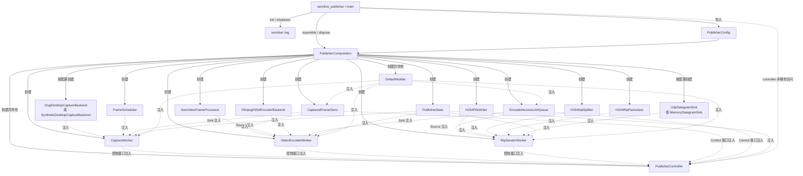

# SemiLive Publisher 首版设计

本文定义 SemiLive 发布端首个视频阶段的架构基线。当前目标是在 Windows 上完成可验证的
桌面视频发布链路：

```text
DXGI 桌面采集 -> BGRA 处理 -> H.264 低延迟编码 -> RFC 6184 RTP 封包 -> UDP 发送
```

本文只描述已经决定的模块边界、线程模型和运行语义。实现过程中如果改变这些约定，应先
更新本文并记录原因。

## 1. 范围

### 1.1 本阶段目标

- 使用 DXGI Desktop Duplication 采集 Windows 桌面；
- 按固定帧率产生 BGRA 视频帧；
- 缩放并转换为编码器接受的像素格式；
- 使用 FFmpeg 后端进行 H.264 低延迟编码；
- 输出 Annex-B Access Unit，支持保存为本地 `.h264` 文件；
- 按 RFC 6184 完成 Single NAL 和 FU-A RTP 封包；
- 通过 UDP 向指定地址发送 RTP；
- 输出采集、丢帧、编码、队列和发送统计；
- 支持 Ctrl+C、工作线程失败和正常停止时的确定性退出。

### 1.2 非目标

本阶段不实现：

- 系统音频采集、音频编码和音画同步；
- 摄像头采集和采集源运行时切换；
- 硬件编码及 GPU 零拷贝；
- RTCP、重传、拥塞控制和自适应码率；
- RTSP、WebRTC、信令和 NAT 穿透；
- Linux Relay 和多接收端会话管理；
- GUI、预览窗口和完整 SDK 接口；
- 运行中无缝改变分辨率、帧率或编码器。

设计上不阻碍后续音频链路，但当前不预先提取 `IMediaSource`、`IMediaEncoder` 等过度
通用的音视频抽象。

## 2. 设计原则

Publisher 参考 SemiPlayer 已验证的模块风格，并针对首个视频阶段裁剪复杂度：

- 应用编排、领域 Worker、领域资源、后端契约和基础设施分层；
- Worker 依赖后端契约，不直接依赖 DXGI、FFmpeg 或 Winsock 具体类型；
- Worker 拥有并独占自己的线程和有线程亲和性的后端；
- 相邻 Worker 只通过容量受限的领域资源传递数据；
- 领域资源分别暴露 Sink、Source 和 Control 接口；
- 领域资源只提供非阻塞数据操作，不拥有条件变量或 Worker 停止语义；
- 通知只用于唤醒，正确性始终依赖重新检查真实谓词；
- 构造期注入依赖，运行期不使用服务定位器；
- 第一版不引入 C ABI、异步命令句柄、Generation 和通用媒体 Graph。

## 3. 分层与模块

| 层次 | 模块 | 职责 |
|---|---|---|
| 应用层 | `PublisherController` | 校验会话状态，编排启动、停止、等待和失败汇聚 |
| 领域 Worker | `CaptureWorker` | 按目标帧率采集并发布 BGRA 帧 |
| 领域 Worker | `VideoEncoderWorker` | 消费 BGRA 帧，完成像素处理和 H.264 编码 |
| 领域 Worker | `RtpSenderWorker` | 保存可选码流、拆分 NAL、RTP 封包和 UDP 发送 |
| 领域资源 | `CapturedFrameStore` | 容量受限的最新采集帧存储 |
| 领域资源 | `EncodedAccessUnitQueue` | 容量受限且保持编码顺序的 AU 队列 |
| 领域服务 | `FrameScheduler` | 固定帧率调度及采集时间戳生成 |
| 领域服务 | `H264NalSplitter` | 拆分 Annex-B Access Unit 中的 NAL |
| 领域服务 | `H264RtpPacketizer` | RFC 6184 Single NAL/FU-A 封包 |
| 后端契约 | `DesktopCaptureBackend` | 提供最新桌面图像 |
| 后端契约 | `VideoFrameProcessor` | 缩放和像素格式转换 |
| 后端契约 | `VideoEncoderBackend` | 接收处理后的视频帧并输出 H.264 AU |
| 后端契约 | `DatagramSink` | 发送一个完整数据报 |
| 基础设施 | `DxgiDesktopCaptureBackend` | D3D11/DXGI Desktop Duplication 实现 |
| 基础设施 | `SyntheticDesktopCaptureBackend` | 可重复测试画面实现 |
| 基础设施 | `SwsVideoFrameProcessor` | FFmpeg libswscale 像素处理实现 |
| 基础设施 | `FfmpegH264EncoderBackend` | FFmpeg H.264 编码实现 |
| 基础设施 | `UdpDatagramSink` | Winsock UDP 实现 |
| 基础设施 | `MemoryDatagramSink` | RTP 单元和集成测试实现 |
| 基础设施 | `H264FileWriter` | 可选 Annex-B 诊断输出 |
| 基础设施 | `DefaultNotifier` | 按事件类型同步发布轻量边界通知 |
| 公共基础设施 | `semilive::log` | 进程级异步日志、滚动文件、控制台输出和故障降级 |
| 可观测性 | `PublisherStats` | 原子计数、耗时累计、峰值和统计快照 |
| 装配层 | `PublisherComposition` | 管理进程级模块装配、所有权和逆序释放 |

## 4. 依赖关系

本节只表达对象的创建、注入和持有关系。`PublisherComposition` 在进程存活期间持有完整
对象图，但不参与运行时控制调用或媒体数据处理；运行时媒体关系由下一节的数据流图表达。

### 构造依赖图

实线表示创建，虚线表示构造函数注入或非拥有访问。`PublisherComposition::assemble()`
创建并持有完整对象图，`dispose()` 按依赖逆序释放。



`PublisherComposition` 只向 Main 暴露非拥有的 `PublisherController` 指针或引用，其有效期
从 `assemble()` 成功持续到 `dispose()` 开始。Main 不得持有 Controller 的共享所有权；
Composition 也不得暴露 Worker、Store 或 Backend 查找接口。

依赖约束：

- `CaptureWorker` 不知道编码器和 RTP；
- `VideoEncoderWorker` 不知道 DXGI 和 UDP；
- `H264RtpPacketizer` 不知道 socket；
- `DatagramSink` 不理解 H.264；
- 基础设施可以依赖契约，契约不得依赖基础设施；
- 底层模块不得依赖 `PublisherController` 或 `PublisherComposition`；
- `PublisherComposition` 只管理进程级生命周期，不作为运行期服务定位器。

日志由 Main 在 Composition 装配前初始化、在 Composition 释放后关闭，因此装配和析构阶段
也可记录故障。日志是进程级公共基础设施，不进入 Composition 对象图，也不通过构造函数
注入业务模块。

## 5. 运行时数据流

```mermaid
flowchart LR
    Desktop[Windows Desktop] --> Dxgi[DXGI Capture Backend]
    Synthetic[Synthetic Source] -. tests .-> CaptureWorker[CaptureWorker Thread]
    Dxgi --> CaptureWorker
    CaptureWorker -->|CapturedFrame| FrameStore[CapturedFrameStore\ncapacity = 2\ndrop oldest]
    FrameStore --> EncoderWorker[VideoEncoderWorker Thread]
    EncoderWorker --> Processor[BGRA -> YUV420P/NV12]
    Processor --> H264[FFmpeg H.264 Encoder]
    H264 -->|EncodedAccessUnit| AuQueue[EncodedAccessUnitQueue\ncapacity = 4\nreject when full]
    AuQueue --> SenderWorker[RtpSenderWorker Thread]
    SenderWorker --> Writer[Optional .h264 Writer]
    SenderWorker --> Splitter[Annex-B NAL Splitter]
    Splitter --> Packetizer[RFC 6184 Packetizer]
    Packetizer --> Udp[UDP Datagram Sink]
```



第一版通过 CPU 内存传递像素。DXGI 后端在释放 acquired frame 前，将有效区域复制到
由 `CapturedFrame` 独占的紧凑 BGRA 缓冲。GPU 纹理跨模块传递和硬件编码留待性能数据
证明必要后再设计。

## 6. 线程模型

| 执行上下文 | 所属模块 | 独占对象 | 阻塞规则 |
|---|---|---|---|
| Main | `semilive_publisher` | Controller、配置和统计展示 | 可以等待启动、停止和会话终态 |
| Capture Thread | `CaptureWorker` | DXGI 后端、FrameScheduler、最近桌面画面 | 可以等待采集或帧率时刻；不得被下游长期阻塞 |
| Encode Thread | `VideoEncoderWorker` | swscale 和 FFmpeg 编码上下文 | 输入为空或 AU 输出满时等待 |
| Send Thread | `RtpSenderWorker` | Packetizer状态、UDP socket、文件句柄 | 输入为空时等待；发送失败按错误策略处理 |

每个 Worker 拥有自己的线程，但线程只执行该 Worker 的私有循环。后端对象在所属线程中
打开、使用和关闭，避免跨线程调用 D3D11 context、FFmpeg codec context 和 socket 状态。

首版 Worker 状态机保持最小：

```text
Constructed -> Starting -> Running -> Stopping -> Stopped
                              \-> Failed
```

本阶段是进程内单次发布会话，不为 Worker 增加通用命令队列和多会话状态机。

## 7. 领域数据

### 7.1 CapturedFrame

```cpp
struct CapturedFrame {
    std::vector<std::byte> bgra;
    std::uint32_t width = 0;
    std::uint32_t height = 0;
    std::uint32_t stride = 0;
    std::uint64_t sequence = 0;
    std::chrono::steady_clock::time_point captured_at;
};
```

约束：

- `bgra` 由该对象独占，跨线程后不再被采集后端修改；
- `stride` 首版为紧凑行宽，仍保留字段避免接口依赖隐含假设；
- `sequence` 按调度输出帧递增，重复桌面画面也产生新序号；
- `captured_at` 来自单调时钟，不使用系统墙上时间。

### 7.2 EncodedAccessUnit

```cpp
struct EncodedAccessUnit {
    std::vector<std::byte> annex_b;
    std::int64_t pts_90khz = 0;
    bool key_frame = false;
    std::uint64_t source_sequence = 0;
    std::chrono::steady_clock::time_point captured_at;
};
```

约束：

- 一个对象表示同一显示时刻的完整 H.264 Access Unit；
- `annex_b` 使用 start code 分隔 NAL；
- `pts_90khz` 和 RTP 视频时钟使用相同的 90 kHz 时间基；
- `captured_at` 贯穿编码和发送，用于计算阶段延迟。

## 8. 领域资源与背压

### 8.1 CapturedFrameStore

接口拆分为：

```text
CapturedFrameSink   仅供 CaptureWorker
CapturedFrameSource 仅供 VideoEncoderWorker
CapturedFrameStoreControl 仅供 PublisherController
```

首版容量为 2。Store 已满时，接受最新帧并替换最旧的未编码帧，同时增加丢帧统计。
直播链路优先保留最新画面，不能因为编码短暂变慢而持续增加端到端延迟。

资源只提供非阻塞的 `try_push()`、`try_pop()`、`empty()` 和状态查询。Store 从空变为非空
时发送 `CapturedFrameStoreNotEmpty`；Worker 的通知回调只设置 hint 并唤醒自己的条件变量。
`clear()` 只属于 Control 接口，用于停止或失败会话后的防御性清理，并返回被丢弃的帧数。

### 8.2 EncodedAccessUnitQueue

接口拆分为：

```text
EncodedAccessUnitSink   仅供 VideoEncoderWorker
EncodedAccessUnitSource 仅供 RtpSenderWorker
EncodedAccessUnitQueueControl 仅供 PublisherController
```

首版容量为 4。Queue 已满时拒绝新项，`VideoEncoderWorker` 保留
`pending_access_unit` 并等待 `NotFull` 后重试。已经编码的 P 帧不能像原始采集帧一样任意
丢弃，否则会损坏后续参考关系。

如果发送端持续无法消费：

```text
AU Queue 满
-> Encoder 等待
-> CapturedFrameStore 开始替换旧帧
-> 内存保持有界，延迟不持续累积
```

Queue 从空变为非空时发送 `EncodedAccessUnitQueueNotEmpty`，从满变为非满时发送
`EncodedAccessUnitQueueNotFull`。`clear()` 清空满队列时也发送一次 `NotFull`，并返回被丢弃
的 AU 数量。

两个资源都不包含条件变量、`stop_token`、阻塞等待、`close()` 或 `closed` 状态。每个
Worker 使用自己的条件变量统一响应资源 hint、控制命令、失败和线程退出，并在醒来后重新
检查资源的真实状态。正常停流由 Controller 按序命令 Worker 排空，资源析构只发生在所有
Worker 线程停止之后。

## 9. 时间戳与帧率

会话启动时记录：

```text
session_origin = steady_clock::now()
```

调度帧时间转换为 90 kHz PTS：

```text
pts_90khz = round((captured_at - session_origin) * 90000)
```

首版规则：

- 默认以 30 fps 调度输出帧；
- DXGI 在一个调度周期内没有新画面时，重复最近的有效画面；
- 重复帧获得新的序号和 PTS；
- 编码器 time base 使用 `1/90000`；
- RTP 初始时间戳随机生成；
- `rtp_timestamp = initial_timestamp + pts_90khz`，截断为无符号 32 位；
- 一个 Access Unit 的所有 RTP 包共享同一时间戳；
- 不使用系统墙上时间，不假设 RTP 时间戳永不回绕。

尚未取得第一帧时，不生成空白帧；Worker 继续等待有效桌面画面或停止请求。

## 10. 编码和 RTP 基线

首版目标参数：

| 参数 | 默认值 |
|---|---:|
| 输出分辨率 | 1920 x 1080 |
| 帧率 | 30 fps |
| 视频码率 | 4 Mbps |
| GOP | 60 帧 |
| B 帧 | 0 |
| 编码预设 | `ultrafast` |
| 低延迟调优 | `zerolatency` |
| H.264 输出 | Annex-B |
| RTP Payload Type | 96 |
| RTP Clock Rate | 90000 |
| UDP MTU | 1200 bytes |

RTP 规则：

- 小于有效 MTU 的 NAL 使用 Single NAL Unit；
- 大 NAL 使用 FU-A，禁止产生空分片；
- Marker 只设置在 Access Unit 最后一个 RTP 包；
- 序列号和 SSRC 在会话开始时随机生成；
- SPS/PPS 在 IDR 前以带内方式提供；
- 第一版不实现 STAP-A、RTCP 和丢包恢复。

具体 FFmpeg H.264 编码器名称在实现前根据开发和 CI 环境确认；首版只选择一个软件编码
后端，不同时维护多个编码器分支。

## 11. 启动、停止和错误传播

### 11.1 进程装配

Main 调用 `PublisherComposition::assemble()` 创建 Notifier、资源、后端、Worker 和
Controller。Worker 线程属于模块生命周期，可以在装配阶段启动并等待控制命令；装配失败
时 Composition 逆序停止并释放已经创建的模块。

装配成功后，Main 通过 Composition 获取有效期受限的 Controller 非拥有访问。Main 只调用：

```text
PublisherComposition: assemble / controller / dispose
PublisherController: start_publishing / stop_publishing / state / stats
```

### 11.2 开始发布

`PublisherController::start_publishing()` 先清理上一次非正常会话残留，再按消费者到生产者
的顺序配置并启动会话：

```text
RtpSenderWorker -> VideoEncoderWorker -> CaptureWorker
```

任一阶段启动失败时，Controller 按逆序停止已经启动的会话模块、清理资源并返回结构化
错误；Worker 模块及其常驻线程仍由 Composition 持有。

### 11.3 正常停止

Ctrl+C 触发正常停止：

```text
1. Controller 命令 CaptureWorker 停止当前采集会话并等待确认
2. 确认不再产生新帧后，命令 VideoEncoderWorker 排空 Frame Store
3. VideoEncoderWorker flush 编码器并回到 Idle
4. 命令 RtpSenderWorker 排空 AU Queue，关闭当前文件和 socket
5. RtpSenderWorker 回到 Idle，Controller 状态回到 Idle
6. Controller 通过 Control 接口防御性 clear 两个空资源
```

因为两个领域资源都有固定容量，正常停止时的剩余工作量有明确上界。

### 11.4 致命错误

Worker 只上报第一个致命错误。Controller 收到错误后向三个 Worker 发送立即停止命令；
Worker 自己的条件变量由控制命令直接唤醒，不依赖资源通知。致命错误路径不保证排空媒体
数据，Controller 通过 Control 接口清理残留数据，优先保证及时、确定地回到 Failed 状态。

错误包含：

- 领域错误类别；
- 失败操作；
- DXGI、FFmpeg 或 Winsock 原生错误码；
- 可读错误信息。

异常不得越过线程入口；Worker 顶层捕获异常并转换为内部失败。

### 11.5 进程释放

Main 在退出前调用 `PublisherComposition::dispose()`。如果当前会话仍在运行，Composition
先要求 Controller 停止会话，再停止 Controller 控制线程和三个 Worker 常驻线程，最后按
依赖逆序释放 Worker、Backend、资源、Stats 和 Notifier。

资源析构时必须已经没有线程访问它们。`dispose()` 幂等；Composition 析构函数将其作为
兜底调用，但正常路径仍显式调用，以便记录停止失败。

## 12. 可观测性

`PublisherStats` 不创建线程。三个 Worker 更新原子计数和耗时累计，Main 每秒读取一致的
统计快照。

首版至少记录：

- DXGI 新画面数量；
- 调度输出帧数；
- 采集帧替换数量；
- 编码输入和输出帧数；
- 关键帧数量；
- 编码失败数量；
- 编码平均、最大耗时；
- H.264 输出字节数和估算码率；
- RTP 包数、发送字节数和 UDP 错误数；
- 两个领域资源的当前水位和峰值水位；
- 采集到编码完成、采集到发送完成的平均和最大延迟。

日志不承载高频指标；逐帧、逐包日志默认关闭。

日志采用异步 `OverrunOldest` 策略，避免日志队列反压采集、编码和发送线程。Worker 只记录
生命周期、状态迁移、后端错误和周期汇总；Notifier 捕获的回调异常必须记录后继续分发。

## 13. 测试策略

### 13.1 领域单元测试

- `CapturedFrameStore` 容量、替换、clear 和 `NotEmpty` 边界通知；
- `EncodedAccessUnitQueue` 顺序、满、pending AU、clear 和边界通知；
- Notifier 的类型隔离、订阅生命周期和并发分发；
- FrameScheduler 帧率和 PTS 单调性；
- Annex-B NAL 拆分；
- RTP Header、序列号、时间戳和 Marker；
- FU-A 边界、重组一致性和 MTU 上界；
- Worker 停止、后端失败和 pending output。

### 13.2 无设备集成测试

```text
SyntheticDesktopCaptureBackend
-> VideoEncoderWorker
-> FakeVideoEncoderBackend 或 FFmpeg Backend
-> RtpSenderWorker
-> MemoryDatagramSink
```

普通 Windows/Linux CI 不依赖真实桌面、显卡或网络。

### 13.3 外部交叉验证

- Synthetic/DXGI -> FFmpeg 编码 -> `.h264`；
- 使用 `ffprobe` 检查编码格式、分辨率、帧率和时间戳；
- 使用 `ffplay` 播放输出；
- 使用 SemiStreamProbe 检查 RTP/NAL/FU-A；
- 视频闭环完成后执行 1080p30、30 分钟稳定性测试。

DXGI 真实桌面测试属于 Windows 专用集成测试，不作为无桌面 CI 的硬性条件。

## 14. 建议目录

```text
src/common/
  infrastructure/
    log/...

src/publisher/
  application/
    publisher_controller.*
    publisher_config.*

  contracts/
    capture/desktop_capture_backend.*
    processing/video_frame_processor.*
    encoder/video_encoder_backend.*
    transport/datagram_sink.*

  domain/
    media/captured_frame.*
    media/encoded_access_unit.*
    resource/captured_frame_store/...
    resource/encoded_access_unit_queue/...
    worker/capture/...
    worker/video_encoder/...
    worker/rtp_sender/...
    rtp/h264_nal_splitter.*
    rtp/h264_rtp_packetizer.*
    timing/frame_scheduler.*
    stats/publisher_stats.*

  infrastructure/
    notifier/notifier.*
    notifier/default_notifier.*
    capture/dxgi_desktop_capture_backend.*
    capture/synthetic_desktop_capture_backend.*
    ffmpeg/sws_video_frame_processor.*
    ffmpeg/ffmpeg_h264_encoder_backend.*
    transport/udp_datagram_sink.*
    transport/memory_datagram_sink.*
    output/h264_file_writer.*

  composition/
    publisher_composition.*

  main.cpp
```

测试目录按相同层次镜像组织。实现时允许在不破坏依赖方向的前提下合并过小文件，避免为
目录结构本身制造样板代码。

## 15. 已决定与延后决定

### 已决定

- 首阶段只做视频，不做音频；
- 三个领域 Worker 各自拥有一个线程；
- BGRA CPU 帧跨采集和编码线程传递；
- 像素处理与编码由同一个 Worker 线程执行；
- 采集帧资源容量 2，满时替换最旧帧；
- 编码 AU 资源容量 4，满时保留 pending AU 并等待；
- 资源只提供非阻塞操作和边界通知，Worker 自己负责条件等待；
- Sink/Source 不提供关闭和清空能力，clear 只通过 Control 接口暴露给 Controller；
- Composition 持有进程级对象图，Controller 只编排存活期间的发布会话；
- H.264、Annex-B、90 kHz 时间基、RTP/UDP、Single NAL 和 FU-A；
- 支持可选 `.h264` 文件输出；
- 使用 Synthetic、Fake 和 Memory 后端保证可测试性。

### 实现前确认

- 开发环境和 CI 统一使用的 FFmpeg H.264 编码器名称；
- 目标屏幕不是 16:9 时采用裁剪、拉伸还是等比缩放加填充；
- DXGI 首版是否合成鼠标指针；
- `.h264` 文件输出与 RTP 是否允许同时开启。

### 后续阶段再决定

- WASAPI、音频编码格式和音视频统一时间线；
- 硬件编码和 GPU 零拷贝；
- 运行时采集设备及编码参数切换；
- RTCP、反馈、重传和拥塞控制；
- Relay 会话协议和多接收端管理。
